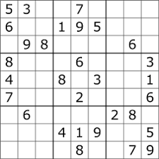
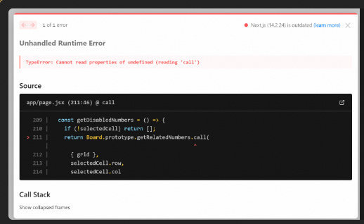
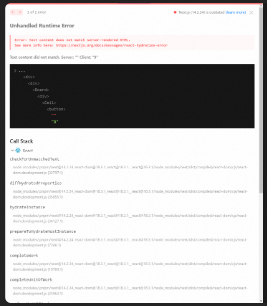

1. 重构成一个sudok游戏，ui参考图片
2. 请检查整个项目的代码，引入合适的库，修正所有错误
3. 注意，这个工程使用pnpm，而不是npm
4. 你有注意到终端上 pnpm dev输出的错误吗？怎么修正？
5. 为游戏增加New Game按钮，点击之后重置游戏，并随机生成一个soduk的初始布局
6. 优化一下游戏的UI表现：
  * 9宫格划分成3*3的大块
  * 对于初始有值的格子、输入的格子、正在输入的格子使用不同底色区分
7. 优化输入体验：点击一个可以输入的格子时，在主界面最右边从上到下显示1-9供选择
8. 右边的格子布局紧凑一点，和主界面高度一样，使用一个不同的边框及底色标志
9. 运行时报错：

```
 73 |             isSelected={selectedCell && selectedCell.row === i && selectedCell.col === j}
  74 |             onChange={(newValue) => {
> 75 |               onCellChange(i, j, newValue);
     |               ^
  76 |               onCellSelect(i, j);
  77 |             }}
  78 |             row={i}
  ```

10. 选中一个格子时，改变其所在行列及3*3块区域的格子底色
11. 检查输入，如果跟其所在行列、3*3格子有冲突时，改变冲突的格子里面数字颜色和底色，突出错误
12. 当选中一个格子输入时，自动灰化可能冲突的输入选项
13. 运行时错误，解决一下
14. 重新刷新页面时，会报错，请修复一下
15. 增加难度设置1-10，难度1时只留9个空格
16. 解密成功后，弹框显示成功，最好能有个散花的特效
17. 优化界面布局：把难度选择变成一个小按钮放到New Game左边
18. 增加一个提示按钮，使用灯的图标，点击后给出下一个输入提示
19. 一直点击Hint按钮完成游戏，没有触发游戏完成判断
20. 创建 README.md，并添加内容